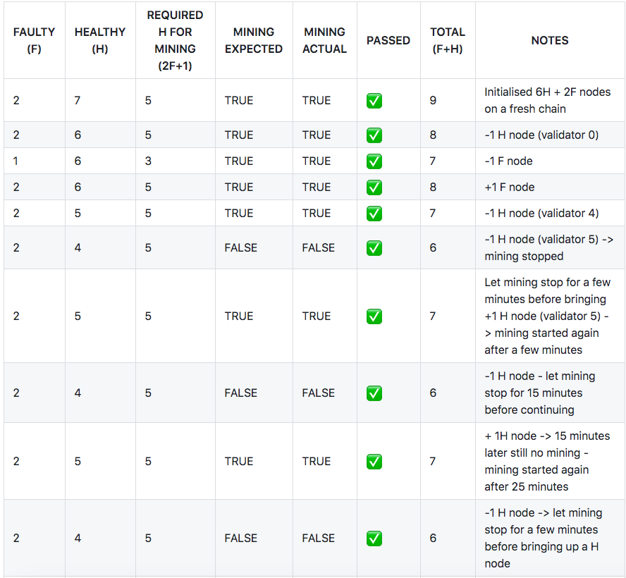
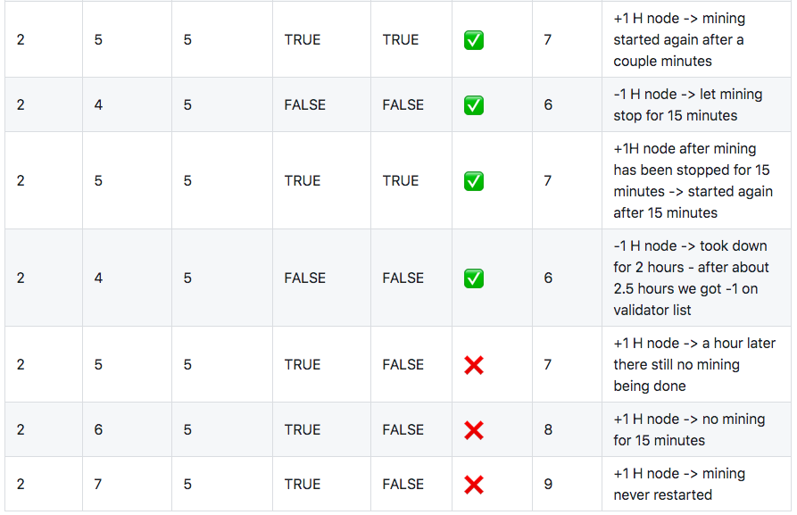

Ledgerium Test Suite
==========================================

Faulty Node Test
----------------

The main focus was to test the hypothesis that a correlation exists between the time elapsed when mining stopped and how long the mining took to restart when condition 2F+1 is satisified. It appears that the faster we satisify the condition, the faster mining restarts. However, when mining has been stopped for >2 hours, it has been observed mining will not resume again.

Quorum Acceptance Tests
-----------------------

https://github.com/ledgerium-io/quorum-acceptance-tests
