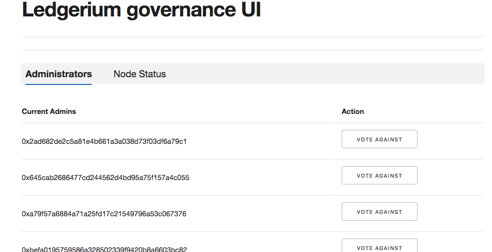
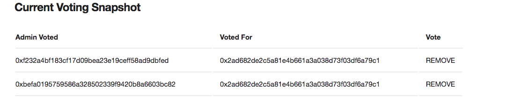
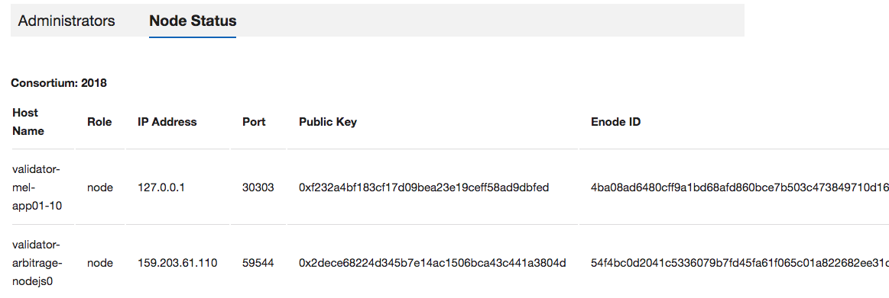

Running a Ledgerium Master Node
==========================================

Getting started
----------------
This is a full guide to set up a Ledgerium "addon" node on a fresh linux machine
The blockchain ecosystem is a combination of multiple technologies that come together. It is overwhelming to know that so much has been achieved in a short span. The tech stacks range from (not limited to this list) GoLang, NodeJs, Haskell, Metamask, Solidity and supporting Web3 technologies. Hence this will always remain as a living document for the team.

================================
One-click Dependencies Installer
================================

`ledgerium_setup.sh` is a unix bash file that downloads and deploys one Ledgerium node (consists of Geth, Constellation/Tessera, and GovernanceUI Docker containers) in a single click.

Download <https://github.com/ledgerium/ledgeriumsetup/>

To download **ledgeriumsetup** go to the console and type

* `mkdir ledgerium`

* `cd ledgerium`

* `git clone https://github.com/ledgerium-io/ledgeriumsetup.git`

* `cd ledgeriumsetup`

* `./install_dependencies.sh`

This script does the following:
* Install prerequisite softwares (Docker and NodeJS) to run ledgerium tools.
* Add $USER to docker group, to avoid using sudo before docker commands
* Creates a docker network

Once the dependencies are done installing go ahead and run the node

* `./ledgerium_setup.sh`

This script prompts user for 3 parameters, mode `addon`, numbers of nodes, and mnemonics for each node. The script creates a docker-compose file and brings up the cointainers

What is Mnemonics
-----------------

The mnemonic is just a random string

------------


============
Manual Setup
============


SET UP THE REPOSITORY
----------------------

Reference: https://docs.docker.com/install/linux/docker-ce/ubuntu/

1. Update the `apt` package index:
```
$ sudo apt-get update
```

2. Install packages to allow `apt` to use a repository over HTTPS:

```
$ sudo apt-get install \
apt-transport-https \
ca-certificates \
curl software-properties-common
```

3. Add Docker’s official GPG key:
```
$ curl -fsSL https://download.docker.com/linux/ubuntu/gpg | sudo apt-key add -
```
should return OK


```
$ sudo apt-key fingerprint 0EBFCD88

pub   4096R/0EBFCD88 2017-02-22
      Key fingerprint = 9DC8 5822 9FC7 DD38 854A  E2D8 8D81 803C 0EBF CD88
uid                  Docker Release (CE deb) <docker@docker.com>
sub   4096R/F273FCD8 2017-02-22
```

4. Use the following command to set up the stable repository. You always need the stable repository, even if you want to install builds from the edge or test repositories as well. To add the edge or test repository, add the word edge or test (or both) after the word stable in the commands below.


```
$ sudo add-apt-repository "deb [arch=amd64] https://download.docker.com/linux/ubuntu $(lsb_release -cs) stable" sudo apt-get update
```

```
Note: The lsb_release -cs sub-command below returns the name of your Ubuntu distribution, such as xenial. Sometimes, in a distribution like Linux Mint, you might need to change $(lsb_release -cs) to your parent Ubuntu distribution. For example, if you are using Linux Mint Rafaela, you could use trusty.
```

Install Docker CE
------------------------

1. Update the apt package index.

```
$ sudo apt-get update
```

2. Install the latest version of Docker CE, or go to the next step to install a specific version:
```
$ sudo apt-get install docker-ce
```

3. Verify that Docker CE is installed correctly by running the `hello-world` image.
```
$ sudo docker run hello-world
```

Install Docker Compose
-----------------------

Reference : https://docs.docker.com/compose/install/

1. Run this command to download the latest version of Docker Compose:

```
$ sudo curl -L "https://github.com/docker/compose/releases/download/1.23.2/docker-compose-$(uname -s)-$(uname -m)" -o /usr/local/bin/docker-compose
```
```
Note : Install Docker Engine version 1.7.1 or greater: ...
```
2. Apply executable permissions to the binary:
```
$ chmod +x /usr/local/bin/docker-compose.
```
> 1. Optionally, install command completion for the bash and zsh shell.
> 2. Test the installation by docker-compose
> ```
> $ docker-compose --version
> docker-compose version 1.23.2, build 1110ad01
> ```

To create the docker group and add your user:
----------------------------------------------

1. Create the docker group.
```
$ sudo groupadd docker
```

2. Add your user to the docker group.

```
$ sudo usermod -aG docker $USER
```

3.  Log out and log back in so that your group membership is re-evaluated.

> If testing on a virtual machine, it may be necessary to restart the virtual machine for changes to take effect.

> On a desktop Linux environment such as X Windows, log out of your session completely and then log back in.

4. Verify that you can run docker commands without sudo .
```
$ docker run hello-world
```

Install NodeJS
--------------

Reference:  https://linuxize.com/post/how-to-install-node-js-on-ubuntu-18.04/

```
sudo apt-get update &&
sudo apt-get -y upgrade &&
curl -sL https://deb.nodesource.com/setup_8.x -o nodesource_setup.sh &&
sudo bash nodesource_setup.sh &&
sudo apt-get install nodejs &&
rm nodesource_setup.sh
```


Blockchain full Node setup
-----------------------

* 1. Clone Ledgerium tools
Ledgerium tools is used to create a docker-compose.yml file
```
mkdir ledgerium
cd ledgerium
git clone http://github.com/ledgerium/ledgeriumtools.git
cd ledgeriumtools
npm install
```

Update initialparams.json file :
```
vi initialparams.json
```
Change `modeType = full`, `nodeName = $(hostname)` and `domainName`

```
Note: User has to edit these values in the json file before running ledgerium tools application
```

* 2. Create a docker network
```
docker network create -d bridge --subnet 172.19.240.0/24 --gateway 172.19.240.1 test_net
```

* 3. Run Ledgerium tools application

Run ledgerium tools application. Note: 'Number of Mnemonics' refers to the amount of nodes you want to spawn (minimum 4)
```
node index.js
```

docker-compose will be generated in output folder

```
cd output
sudo docker-compose up -d
```

* 4. Check application status

Check the ./logs/constellationLogs and ./logs/gethLogs folders are created.

* `docker ps -a` shows list of containers mentioned below

    * Quorum node, governance_app_ui and constellation for each node
    * Quorum maker
    * Eth-stats
* Running `geth attach` command will work for quorum nodes.

### 5. Update ledgerium network repository
After running `ledgeriumtools` application, `ledgeriumnetwork` folder ( which contains genesis and static-nodes files) will be created outside the `ledgeriumtools` folder. Push those files to `ledgeriumnetwork` repository.

```
cd ../../ledgeriumnetwork
git push https://github.com/ledgerium/ledgeriumnetwork.git
```
# Deconstructing the docker-compose.yml file

A genereated docker compose file will consist of 3 image containers per node. These are as follows:

1. Ledgerium Core

    Purpose: This is the actual validator node


    Ports required:

    `30303` Network listening port

    `8545` HTTP-RPC server listening port

    `9000` WS-RPC server listening port

2. Constellation or Tessera

    Purpose: Quorum Transaction Manager - implementation of peer-to-peer encrypted message exchange for transaction privacy

    Ports required:

    `10000`

3. Governance App

    Purpose: Goveranance App contains smart contracts to manage admin and individual validators to come on platform

    Ports required:

    `3545`


=========================================================
Confirming Ledgerium Network is up and running correctly
=========================================================


We can see if the application ran correctly by going to ethstats on `http://localhost:3000`

    This will show us:
     * Block data and minting status
     * Validator/Node data
     * Transactions statistics

    .. image:: images/3000.png

    We also have the Quorum dashboard accessible by `http://localhost:9999`

    .. image:: images/9999.png

    And the Governance user intreface accessible by `http://localhost:3545`

    .. image:: images/governance.png


Manually shutting down a node
----------------------------

 * `cd ~/ledgerium/ledgeriumtools/output`
 * `docker-compose down`

Confirm your node is up the same way you would when you first build and run your first node


Manually starting up a node
----------------------------

* `cd ~/ledgerium/ledgeriumtools/output`
* `docker-compose up`


=============
Governance UI
=============

What is it?
-----------

Governance UI is a way for validators to participate in on-chain governance

Role of Validators
-------------------
A Validator is an independent individual who stakes their XLG and is entrusted to maintain a node on the network that validates transactions and commits new blocks to the blockchain. Validators receive a reward in XLG for provisioning blocks.

Responsibilites for Validators
-------------------------------
A Validator has both technical and social responsiblities both of which are important for the health, performance and security of the network.

Technical Responsibilites

* Ensure node is secure by practicing safe key management
* Maintain node requisite software version
* Monitor node to ensure its availablility and participation in consensus
* Monitor network in general and communicate with other Validators, network entities if problems arise.

Social Responsibilites

* Participate in on-chain Governace of the network

Governance is a collection of DApps where ballots are proposed and voted on by existing Validators to manage the network. The Ballot types include:

* Adding new Validators
* Removing Validators, i.e. for compromising security of network, malicious behavior, non-participation in Governance

Prerequisites
-------------

To participate in Governance, you must:

* Be voted in as a Validator
* Have the Ledgerium Wallet installed
* Import your private key to the wallet


What constitutes a passing vote
-------------------------------

A vote is passed if the sum is greater than to n/2, where n is the number of existing validator nodes


Getting started with Governance UI
-----------------------------------

Navigate to `http://testnet.ledgerium.net:3545/`


* Current admins/validator list; if you are a Validator your node will be on this list



* Current voting status



* Online nodes (validator + addon nodes)


